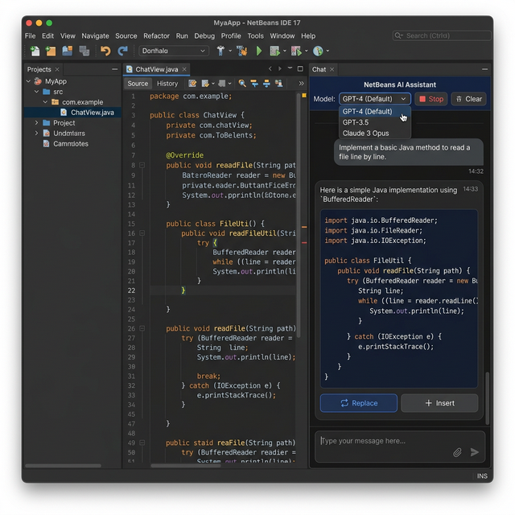

# Continue Beans ☕

**Enterprise-grade AI assistant for Apache NetBeans.**

Continue Beans brings AI-assisted development directly into NetBeans — local and cloud LLMs, workspace context, tool calling, streaming chat, MCP integration, and native NetBeans language services.

<p align="center">
  
</p>

[](LICENSE)
[](https://openjdk.org/)
[](https://netbeans.apache.org/)
[](https://maven.apache.org/)

---

## Features

- **AI chat** integrated into NetBeans (dark, developer-focused UI)
- **Multiple AI providers**: LM Studio, Ollama, and any OpenAI-compatible API
- **Streaming responses** with live token updates
- **Workspace & project context** (files, directories, `@file` / codebase awareness)
- **Tool / function calling** with NetBeans APIs (read/write files, editor, projects)
- **MCP (Model Context Protocol)** tool integration
- **Native NetBeans Java language services**
- **Conversation history** and multi-turn context management
- **Task orchestration** and agent-style workflows
- **Model discovery** and configuration panel
- **JUnit 5 + Cucumber** test suite with JaCoCo coverage

<p align="center">
  
</p>

---

## Requirements

| Requirement | Version / notes |
|-------------|-----------------|
| Java | 11+ (17/21 also supported) |
| Apache NetBeans | RELEASE200 (compatible with recent 20.x builds) |
| Maven | 3.9+ |
| AI backend | LM Studio, Ollama, or any OpenAI-compatible API |

---

## Installation

### Option A — Install from release (recommended)

1. Download the latest `.nbm` from the [Releases](https://github.com/offline0x33/continue-netbeans/releases) page.
2. In NetBeans: **Tools → Plugins → Downloaded → Add Plugins…** and select the `.nbm` file.
3. Install and restart NetBeans when prompted.
4. Open the assistant via **Window → Continue Beans** (or the equivalent menu entry).

### Option B — Build from source

```bash
git clone https://github.com/offline0x33/continue-netbeans.git
cd continue-netbeans
mvn clean install
```

The generated NetBeans module is under `target/*.nbm`.

Run the full verification suite:

```bash
mvn clean verify
```

---

## Quick start

1. **Start an AI backend**
   - **LM Studio**: load a model and enable the local server (usually `http://localhost:1234`).
   - **Ollama**: see [Docker setup](#docker--ollama) or run `ollama serve` locally.
2. Open NetBeans and the **Continue Beans** window.
3. Configure the provider URL / model in the options or chat controls.
4. Chat with workspace context enabled — the assistant can inspect project files and use NetBeans tools.

---

## AI providers

Continue Beans uses a provider abstraction so backends can evolve independently from the UI.

| Provider | Notes |
|----------|--------|
| **LM Studio** | Primary local provider; OpenAI-compatible API |
| **Ollama** | Local models; Docker helpers under `docker/` |
| **OpenAI-compatible** | Any server that speaks the OpenAI chat completions API |

Configuration is managed through the NetBeans options panel and runtime model discovery.

---

## Docker / Ollama

A ready-to-use Ollama stack (with `qwen2.5:7b` as a suggested model) lives in [`docker/`](docker/).

```bash
cd docker
docker-compose up -d ollama
docker exec -it continue-beans-ollama ollama pull qwen2.5:7b
```

Full instructions: [docker/README.md](docker/README.md).

---

## Architecture

```text
NetBeans
   │
   ▼
Continue Beans UI (ChatPanel / TopComponent)
   │
   ├─ Conversation & streaming
   ├─ Workspace tools & file system
   ├─ MCP tools
   ├─ Task orchestrator
   └─ Native language services
           │
           ▼
       LLM Provider layer
           │
           ├─ LM Studio
           ├─ Ollama
           └─ OpenAI-compatible API
```

UI, providers, workspace tooling, and IDE integrations are separated so each layer can evolve independently.

---

## User interface

Continue Beans ships a **dark, developer-oriented** chat as the canonical NetBeans view.

The UI covers conversation streaming, task progress, tool/status feedback, workspace context, model controls, warnings, message actions, and workspace status.

Visual contract: [`docs/UI_SPECIFICATION.md`](docs/UI_SPECIFICATION.md).

---

## Testing

Stack: **JUnit 5**, **Mockito**, **Cucumber**, **JaCoCo**.

```bash
mvn test
mvn verify
```

---

## Project status

Continue Beans is under **active development**.

Implemented:

- Core chat experience with streaming
- Workspace tooling and large-context handling
- Native NetBeans Java language services
- Function / tool calling with NetBeans APIs
- MCP integration
- Canonical dark theme entry point (`ChatPanel`)

Visual-fidelity refinements and additional agent workflows continue on the main line.

---

## Documentation

| Doc | Description |
|-----|-------------|
| [`docs/`](docs/) | Technical docs, guides, and specs |
| [`docs/CHANGELOG.md`](docs/CHANGELOG.md) | Notable changes |
| [`docs/UI_SPECIFICATION.md`](docs/UI_SPECIFICATION.md) | UI visual contract |
| [`docs/LM_STUDIO_REAL_GUIDE.md`](docs/LM_STUDIO_REAL_GUIDE.md) | LM Studio setup |
| [`docker/README.md`](docker/README.md) | Ollama Docker setup |

---

## Contributing

Contributions are welcome.

Before opening a pull request:

1. Build the project (`mvn clean install`).
2. Run the test suite (`mvn test`).
3. Run `mvn verify`.
4. Keep changes focused.
5. Add or update tests for new behavior.

---

## License

[Apache License 2.0](LICENSE).
